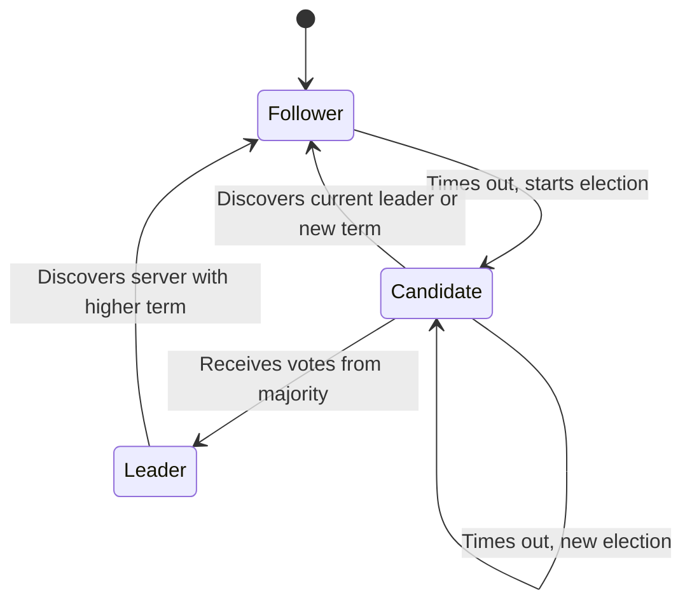

# RAFT Consensus Algorithm in Go

A robust, educational implementation of the RAFT consensus algorithm from scratch in Go. This project aims to demonstrate the core principles of distributed consensus—Leader Election, Log Replication, and Safety—as described in the original whitepaper.

## Overview

RAFT is a consensus algorithm designed for manageability and understandability. It is equivalent to Paxos in fault-tolerance and performance but is structured to be much more intuitive. This implementation provides a functional core that can be used to build distributed, replicated state machines.

### Key Features

- **Leader Election**: Randomized election timeouts to ensure cluster stability.
- **RPC Layer**: Efficient communication using Go's `net/rpc`.
- **State Machine**: Clean separation of roles (Follower, Candidate, Leader).
- **Demo CLI**: Easily spin up a local cluster to observe RAFT in action.

## Architecture

The project is structured following clean architecture principles:

- `cmd/raft-demo`: Entry point for running a local cluster node.
- `internal/raft`: Core RAFT logic including states, transitions, and election logic.
- `internal/rpc`: Communication abstraction to handle inter-node calls.
- `internal/storage`: (Planned) Persistence layer for log entries and stable state.

### Node State Machine

Nodes transition between three states:
1.  **Follower**: The default state. Responds to RPCs from candidates and leaders.
2.  **Candidate**: Becomes active when an election timeout occurs. Votes for itself and requests votes from others.
3.  **Leader**: Established after receiving a majority of votes. Managed heartbeats and client requests.



### Running the Demo

To run a 3-node cluster locally, open three terminals and run the following commands:

**Terminal 1 (Node 0):**
```bash
go run cmd/raft-demo/main.go -id 0 -cluster localhost:8000,localhost:8001,localhost:8002
```

**Terminal 2 (Node 1):**
```bash
go run cmd/raft-demo/main.go -id 1 -cluster localhost:8000,localhost:8001,localhost:8002
```

**Terminal 3 (Node 2):**
```bash
go run cmd/raft-demo/main.go -id 2 -cluster localhost:8000,localhost:8001,localhost:8002
```

## Todo

- [x] Basic RPC Layer
- [x] Leader Election with Randomized Timeouts
- [ ] Log Replication (AppendEntries consistency checks)
- [ ] Persistent Storage for Stable State
- [ ] Log Compaction (Snapshots)
- [ ] Dynamic Membership Changes

