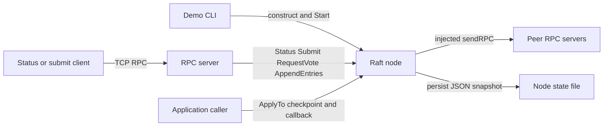
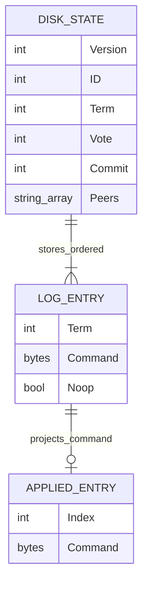
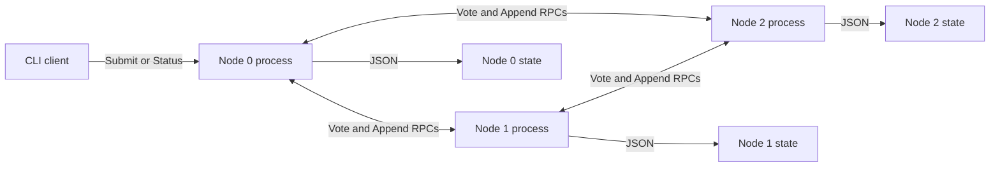

# Architecture

## Overview

The module has three layers: the demo wires dependencies, the transport dispatches RPC methods, and one mutex-protected `Raft` object owns consensus state. Transport is injected as a function, which lets tests replace TCP with an in-process network ([main.go:43](../../cmd/raft-demo/main.go#L43), [types.go:21](../../internal/raft/types.go#L21), [raft_test.go:17](../../internal/raft/raft_test.go#L17)).

## Components

| Component | Responsibility | Lives in | Talks to |
| --- | --- | --- | --- |
| Demo CLI | Parse mode/configuration, build node, start listener, stop on signals. | [cmd/raft-demo/](../../cmd/raft-demo/) · [map](03-structure.md#demo) | Raft and RPC adapter |
| Consensus core | Roles, elections, append consistency, replication progress, commit, application snapshots. | [internal/raft/](../../internal/raft/) · [map](03-structure.md#internal-raft) | Injected sender and persistence helpers |
| Persistence helpers | Validate/recover versioned snapshots; atomically replace durable state. | [internal/raft/](../../internal/raft/) · [storage.go:22](../../internal/raft/storage.go#L22) | Local filesystem |
| TCP/RPC adapter | Register `Raft`, serve connections, bound outgoing calls, close connections on stop. | [internal/rpc/](../../internal/rpc/) · [map](03-structure.md#internal-rpc) | Core RPC methods and remote peers |

## Boundaries and contracts

- **Node identity:** IDs are indexes in the ordered, nonempty, duplicate-free peer list. The persisted ID and exact peer ordering must match on reload; no membership-change API exists ([storage.go:22](../../internal/raft/storage.go#L22), [storage.go:44](../../internal/raft/storage.go#L44)).
- **Transport:** `sendRPC(address, method, args, reply) bool` is the core's only transport dependency. The supplied adapter exposes the exported RPC-compatible methods under `Raft`; it reports both remote-method and network errors as `false` ([types.go:33](../../internal/raft/types.go#L33), [rpc.go:39](../../internal/rpc/rpc.go#L39), [rpc.go:81](../../internal/rpc/rpc.go#L81)). A replacement sender must return promptly if bounded shutdown is required.
- **Client append:** `Propose` accepts bytes only on a healthy leader, copies them, persists, and returns an index. `Submit` wraps it for RPC; there is no automatic leader forwarding or request ID ([replication.go:63](../../internal/raft/replication.go#L63), [types.go:55](../../internal/raft/types.go#L55)).
- **Application:** `Applied` returns copies of all committed application commands on a healthy node, and nil after stop or a persistence failure. `ApplyTo` captures a prefix under the mutex, then invokes callbacks outside it. The caller serializes application and checkpoints its own state ([replication.go:109](../../internal/raft/replication.go#L109)). This API is local Go access; the demo exposes no application RPC.
- **Trust:** Peer and client RPCs share an unauthenticated TCP listener. IDs are validated as ranges, not authenticated identities; fixed trusted peers and exclusive state-file ownership are explicit v1 assumptions ([node.go:28](../../internal/raft/node.go#L28), [rpc.go:23](../../internal/rpc/rpc.go#L23), [README.md:33](../../README.md#L33)).

## Data model

`Index` is a slice position, not a field in a stored `LogEntry`. Index zero is a sentinel; leadership no-ops occupy real indexes but do not become application commands ([storage.go:33](../../internal/raft/storage.go#L33), [node.go:253](../../internal/raft/node.go#L253), [replication.go:119](../../internal/raft/replication.go#L119)).

| Entity | Stored in | Key fields | Defined at |
| --- | --- | --- | --- |
| Durable node snapshot | One JSON file per node | Version, identity, peers, term, vote, commit, complete log | [storage.go:16](../../internal/raft/storage.go#L16) |
| Log entry | Snapshot's ordered log array | Term, copied command bytes, no-op marker | [types.go:16](../../internal/raft/types.go#L16) |
| Live node | Process memory | Role, timers, per-peer next/match indexes, in-flight flags, failure and lifecycle state | [types.go:21](../../internal/raft/types.go#L21) |
| Applied entry | Caller-owned result/callback value | Log index and copied command bytes | [types.go:65](../../internal/raft/types.go#L65) |

## State and persistence

A new persistent node starts with the sentinel and writes an initial snapshot; restart validates format version, identity, ordered peers, terms, bounds, and commit position before restoring state ([storage.go:33](../../internal/raft/storage.go#L33)). Role and replication progress are not persisted, so reopening a node starts it as follower; application effects/checkpoints are also outside this file ([types.go:10](../../internal/raft/types.go#L10), [storage.go:16](../../internal/raft/storage.go#L16)).

`persist` creates directories, marshals the whole state, writes and fsyncs a same-directory temporary file, closes it, renames it over the destination, and fsyncs the containing directory. Errors latch into `r.err`; `check` then rejects guarded operations. It does not roll back earlier in-memory mutations, lock the state file against another process, or fsync the parent of a newly created state directory ([storage.go:74](../../internal/raft/storage.go#L74), [README.md:33](../../README.md#L33)). `NewRaft` passes an empty path, making persistence a no-op ([types.go:70](../../internal/raft/types.go#L70)).

## Deployment

The shipped demo runs one node per process with three localhost addresses by default. Flags can supply other fixed addresses; this module has no container, deployment, or service-manager configuration ([main.go:16](../../cmd/raft-demo/main.go#L16), [structure](03-structure.md#what-lives-where)).

## Failure and scale

- **Partition:** An isolated leader may append locally but cannot advance commit without a majority. Higher-term replies cause step-down; repair replaces only uncommitted conflicting suffixes ([node.go:266](../../internal/raft/node.go#L266), [replication.go:31](../../internal/raft/replication.go#L31), [node.go:117](../../internal/raft/node.go#L117)). The partition test exercises leader replacement and convergence ([raft_test.go:48](../../internal/raft/raft_test.go#L48)).
- **Transport timeout:** Dialing has a 200 ms timeout, followed by a 300 ms connection deadline. A failed submission call can have an unknown result because the server may already have appended ([rpc.go:81](../../internal/rpc/rpc.go#L81), [main.go:34](../../cmd/raft-demo/main.go#L34)).
- **Storage error:** The process stays alive but guarded protocol operations stop making progress; no automatic repair/reopen loop exists ([storage.go:114](../../internal/raft/storage.go#L114), [node.go:174](../../internal/raft/node.go#L174)).
- **Limits:** At most 10,000 entries including the sentinel, 1 MiB per command, 32 MiB command payload, and a 64 MiB input-state-file size check. Every persistence operation rewrites the complete JSON snapshot, under the core mutex; replication copies the full outstanding suffix and permits one in-flight call per peer ([storage.go:12](../../internal/raft/storage.go#L12), [replication.go:14](../../internal/raft/replication.go#L14), [replication.go:72](../../internal/raft/replication.go#L72)). Inference: storage latency and accumulated log size limit throughput before adding peers helps; snapshots/compaction are outside v1 ([V1.md:5](../../V1.md#L5)).
