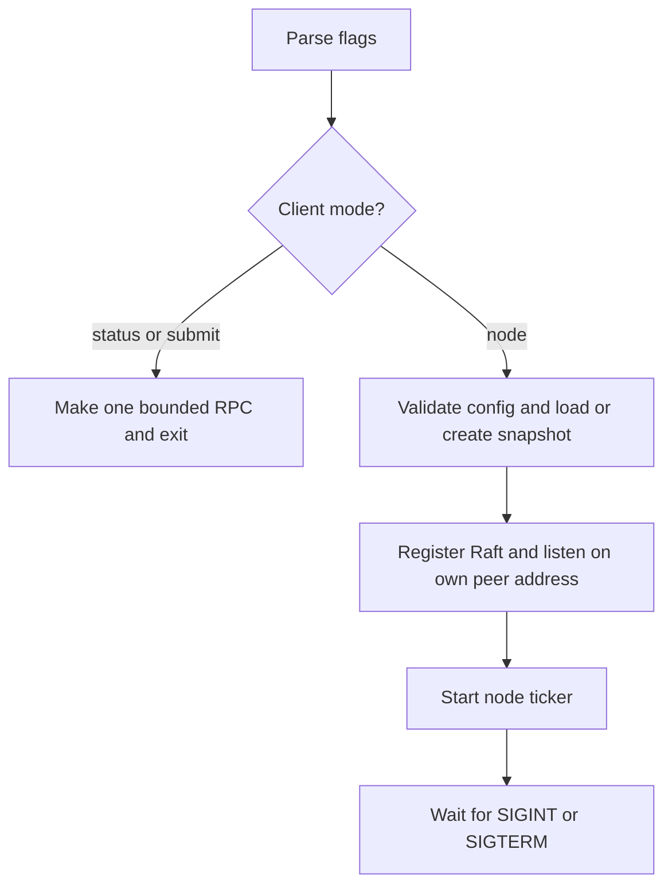
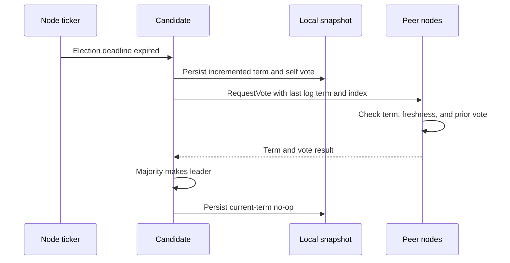
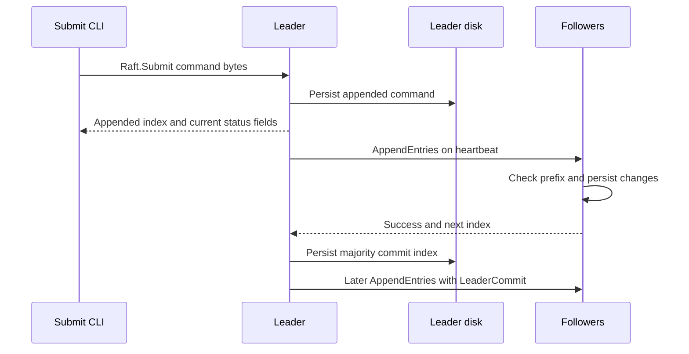
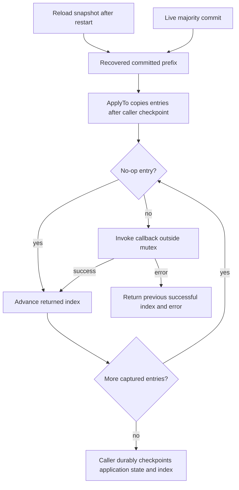
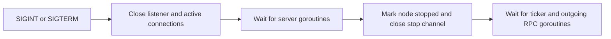

# Flow

## Startup

1. **Choose mode.** Parse node/configuration and client flags. Status takes precedence over submit; either client path exits before constructing a node. [main.go:15](../../cmd/raft-demo/main.go#L15) · [structure](03-structure.md#demo).
2. **Open state.** Default the path, split the ordered peer list, validate configuration, and load or create the version-1 snapshot. Invalid JSON, incompatible identity, bounds violations, and I/O errors abort startup. [main.go:39](../../cmd/raft-demo/main.go#L39), [storage.go:22](../../internal/raft/storage.go#L22) · [structure](03-structure.md#internal-raft).
3. **Listen.** Construct the adapter, listen on `peers[id]`, register the node as `Raft`, and launch the connection accept loop. Bind or registration errors are fatal in the demo. [main.go:47](../../cmd/raft-demo/main.go#L47), [rpc.go:22](../../internal/rpc/rpc.go#L22) · [structure](03-structure.md#internal-rpc).
4. **Start the protocol.** `Start` resets the deadline and launches one 20 ms ticker. Repeated node `Start` calls are ignored, including after stop. Initial follower election deadlines are randomized between 600 ms and just under 900 ms. [node.go:144](../../internal/raft/node.go#L144), [node.go:10](../../internal/raft/node.go#L10), [storage.go:33](../../internal/raft/storage.go#L33) · [structure](03-structure.md#internal-raft).

## Election

1. **Start candidacy.** On expiry, the ticker calls `startElection`; it checks health and rejects an already-leader node, increments term, self-votes, resets the deadline, and persists before issuing vote RPCs. A single-node majority wins immediately. [node.go:178](../../internal/raft/node.go#L178), [node.go:194](../../internal/raft/node.go#L194) · [structure](03-structure.md#internal-raft).
2. **Evaluate requests.** A recipient validates inputs, persists a higher term on step-down, compares last-log term then index, and persists a granted vote before replying. It refuses an older term or a stale candidate. [node.go:22](../../internal/raft/node.go#L22) · [structure](03-structure.md#internal-raft).
3. **Count replies.** Responses are processed under the candidate mutex. A higher term steps down; replies from a superseded candidacy do not count. A strict majority calls `becomeLeader`. [node.go:220](../../internal/raft/node.go#L220) · [structure](03-structure.md#internal-raft).
4. **Initialize leadership.** Append/persist a current-term no-op, allocate next/match indexes, count the leader's own log, attempt commit, and make the next ticker heartbeat immediately eligible. A full log latches a capacity error. [node.go:247](../../internal/raft/node.go#L247) · [structure](03-structure.md#internal-raft).

## Submission and replication

1. **Send a command.** The CLI calls `Raft.Submit` at the supplied address through the bounded adapter. There is no discovery or redirect. Any failed call terminates the client with an unknown-outcome warning. [main.go:31](../../cmd/raft-demo/main.go#L31), [rpc.go:81](../../internal/rpc/rpc.go#L81) · [structure](03-structure.md#demo), [transport](03-structure.md#internal-rpc).
2. **Append locally.** `Submit` invokes `Propose`; it checks health/leadership/capacity, copies the command, persists, updates its own match index, and attempts commit. The returned index is not a multi-node commit acknowledgement. `Submit` reacquires the mutex to populate the reply's term/role. [replication.go:62](../../internal/raft/replication.go#L62) · [structure](03-structure.md#internal-raft).
3. **Replicate asynchronously.** The ticker checks an 80 ms heartbeat interval. `replicate` skips self and peers already in flight, copies each missing suffix, and sends the previous index/term plus current commit. A proposal does not trigger an immediate send. [node.go:180](../../internal/raft/node.go#L180), [storage.go:33](../../internal/raft/storage.go#L33), [replication.go:7](../../internal/raft/replication.go#L7) · [structure](03-structure.md#internal-raft).
4. **Check and repair the follower.** A valid non-stale append makes the receiver a follower and resets its election deadline. Missing or mismatched previous entries return a retry index. Matching prefixes allow copied suffix insertion or uncommitted-suffix replacement; conflicting committed entries and different contents at the same term/index return errors. [node.go:53](../../internal/raft/node.go#L53) · [structure](03-structure.md#internal-raft).
5. **Persist the follower acknowledgement.** Follower commit advances only up to the matched portion of this request; changed log/commit state is persisted before `Success=true`. [node.go:126](../../internal/raft/node.go#L126) · [structure](03-structure.md#internal-raft).
6. **Advance or retry.** Successful replies update match/next indexes; a strict majority storing a current-term entry lets the leader persist a higher commit index. Rejections reduce next index for a later heartbeat attempt; higher-term replies step down. Subsequent appends propagate the new leader commit to followers. [replication.go:27](../../internal/raft/replication.go#L27), [node.go:266](../../internal/raft/node.go#L266) · [structure](03-structure.md#internal-raft).

A client can separately query `Raft.Status`, which returns local term, role, commit, and last-log indexes after a health check. It does not establish a read quorum or identify a command's content ([main.go:23](../../cmd/raft-demo/main.go#L23), [replication.go:96](../../internal/raft/replication.go#L96); [structure](03-structure.md#internal-raft)).

## Application and recovery

1. **Recover the prefix.** Constructor restores log and commit from validated state. It does not replay effects or restore application checkpoints. [storage.go:59](../../internal/raft/storage.go#L59) · [structure](03-structure.md#internal-raft).
2. **Capture work.** The application calls `ApplyTo(lastApplied, callback)`; invalid checkpoint/nil callback or an unhealthy node returns an error. A healthy call copies the committed slice and releases the Raft lock. [replication.go:130](../../internal/raft/replication.go#L130) · [structure](03-structure.md#internal-raft).
3. **Apply in order.** No-ops advance the index without a callback; commands invoke the callback. The first error returns the preceding successful index so retry includes the failing command. New commits during the callback wait for the next call. [replication.go:143](../../internal/raft/replication.go#L143) · [structure](03-structure.md#internal-raft).
4. **Checkpoint externally.** The caller must serialize calls and durably associate the index with application state. `Applied()` is an alternative copied snapshot, not an acknowledgement mechanism. Neither is called by the shipped demo. [replication.go:109](../../internal/raft/replication.go#L109), [main.go:51](../../cmd/raft-demo/main.go#L51) · [structure](03-structure.md#internal-raft), [demo](03-structure.md#demo).

## Shutdown

1. **Stop incoming transport.** The demo receives a signal, calls server `Stop`, closes listener/connections, and waits for connection workers. [main.go:53](../../cmd/raft-demo/main.go#L53), [rpc.go:69](../../internal/rpc/rpc.go#L69) · [structure](03-structure.md#demo), [transport](03-structure.md#internal-rpc).
2. **Stop consensus work.** Node `Stop` marks the terminal stopped state once, closes its channel, and waits for its goroutines. There is no restart of the same object or final flush; preceding mutations use synchronous persistence. [node.go:155](../../internal/raft/node.go#L155), [storage.go:74](../../internal/raft/storage.go#L74) · [structure](03-structure.md#internal-raft).
