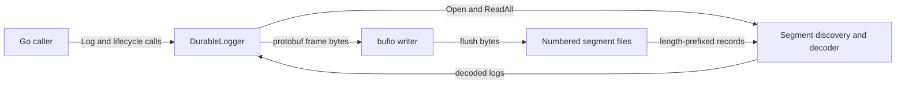
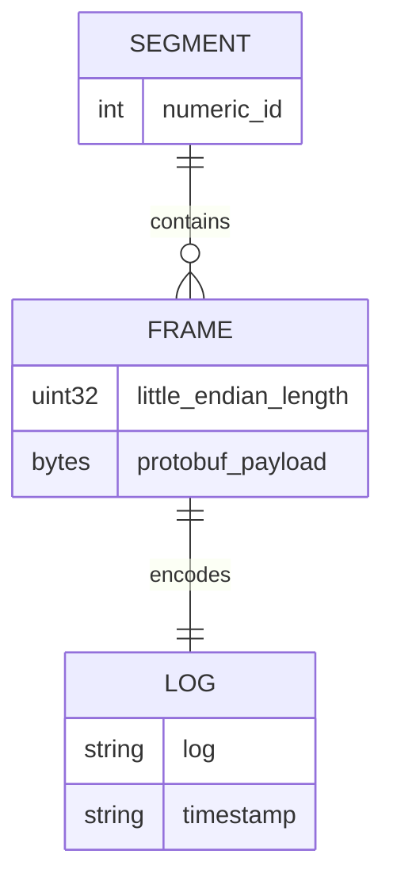

# Architecture

## Overview

One caller-owned `DurableLogger` owns one open append file, one buffered writer, and one mutex. Public operations share this state; a separate parser discovers and decodes segment files ([state](../../durablelogs/core.go#L18), [parser](../../durablelogs/records.go#L19)).

## Components

| Component | Responsibility | Lives in | Talks to |
| --- | --- | --- | --- |
| Demo | Supplies directory and record limit, checks write and close errors. | [Module root](../../) · [inventory](03-structure.md#module-root) | Logger |
| Logger | Serializes access, appends frames, flushes, rotates, and tracks failure state. | [durablelogs](../../durablelogs/) · [inventory](03-structure.md#durablelogs) | Buffer, files, parser |
| Segment parser | Validates names, sorts numeric IDs, bounds and decodes records, repairs latest incomplete tail when requested. | [durablelogs](../../durablelogs/) · [records.go](../../durablelogs/records.go#L19) | Local filesystem, protobuf |
| Wire model | Generated `pb.Log` implementation of the schema. | [pb](../../durablelogs/pb/) · [inventory](03-structure.md#generated-bindings) | Writer and parser |

## Boundaries and contracts

- `Log` accepts a message and returns after buffered writing, not after a mandatory sync. `Flush` drains the buffer, calls file `Sync`, and clears pending messages only on success ([core.go:80](../../durablelogs/core.go#L80), [core.go:110](../../durablelogs/core.go#L110)).
- `ReadAll` flushes first, then returns protobuf records from all segments in numeric order. It may return a flush, directory, or parsing error ([core.go:165](../../durablelogs/core.go#L165)).
- `ErrClosed` and `ErrPoisoned` guard operations returning errors; `Close` is idempotent, and snapshot getters remain available ([check](../../durablelogs/core.go#L65), [getters](../../durablelogs/core.go#L155), [Close](../../durablelogs/core.go#L188)).
- One instance's mutex does not coordinate separate instances or processes. Exclusive directory ownership is a caller requirement ([README](../../README.md#L19), [mutex](../../durablelogs/core.go#L23)).

## Data model

| Entity | Stored in | Key fields | Defined at |
| --- | --- | --- | --- |
| Segment | `dl-N` file in caller directory | Nonnegative canonical numeric ID, records in append order | [records.go:19](../../durablelogs/records.go#L19) |
| Frame | Segment bytes | Four-byte little-endian length, protobuf body | [core.go:98](../../durablelogs/core.go#L98) |
| Log | Protobuf body | Message and UTC RFC3339Nano timestamp string | [log.proto:7](../../log.proto#L7), [core.go:89](../../durablelogs/core.go#L89) |

## State and persistence

Segment contents survive a normal close. Pending message strings, the buffered writer, counters, and poison state live in memory; reopening reconstructs the latest ID and count by scanning every segment ([Open](../../durablelogs/core.go#L41)). `GetBufferedLogs` returns a copy of messages accepted since the last successful flush, including writes that bufio may already have drained ([pending append](../../durablelogs/core.go#L106), [snapshot](../../durablelogs/core.go#L155), [README](../../README.md#L15)).

## Deployment

The supplied topology is one Go demo process and its local directory. Configuration is through `Open(directory, maxPerFile)` arguments, hardcoded by [main.go:9](../../main.go#L9); no service, deployment manifest, or external datastore is supplied in the [module inventory](03-structure.md). New directories use mode `0700`, files `0600`, subject to OS behavior and umask ([creation](../../durablelogs/core.go#L34)).

## Failure and scale

- Write, flush, and rotation failures poison the instance. Subsequent guarded calls return `ErrPoisoned` joined with the saved cause; closing still attempts flushing and file close ([failure tracking](../../durablelogs/core.go#L65), [Close](../../durablelogs/core.go#L188)). Input rejection and ordinary replay parse errors do not themselves poison it.
- Recovery truncates only an incomplete frame in the latest segment. Invalid protobuf and oversized complete headers fail; there is no checksum ([records.go:59](../../durablelogs/records.go#L59)). Missing numeric IDs are accepted because discovery sorts without enforcing continuity ([records.go:35](../../durablelogs/records.go#L35)).
- File sync is the durability boundary. Directory entries are not synced, so creation and rotation names lack a promised power-loss durability guarantee ([README](../../README.md#L21)).
- The mutex serializes reads and writes, `Open` scans all stored records, and `ReadAll` holds the full result in memory. Segments rotate by count rather than bytes, with no retention or compaction path ([Open](../../durablelogs/core.go#L42), [rotation](../../durablelogs/core.go#L93), [ReadAll](../../durablelogs/core.go#L165)).
