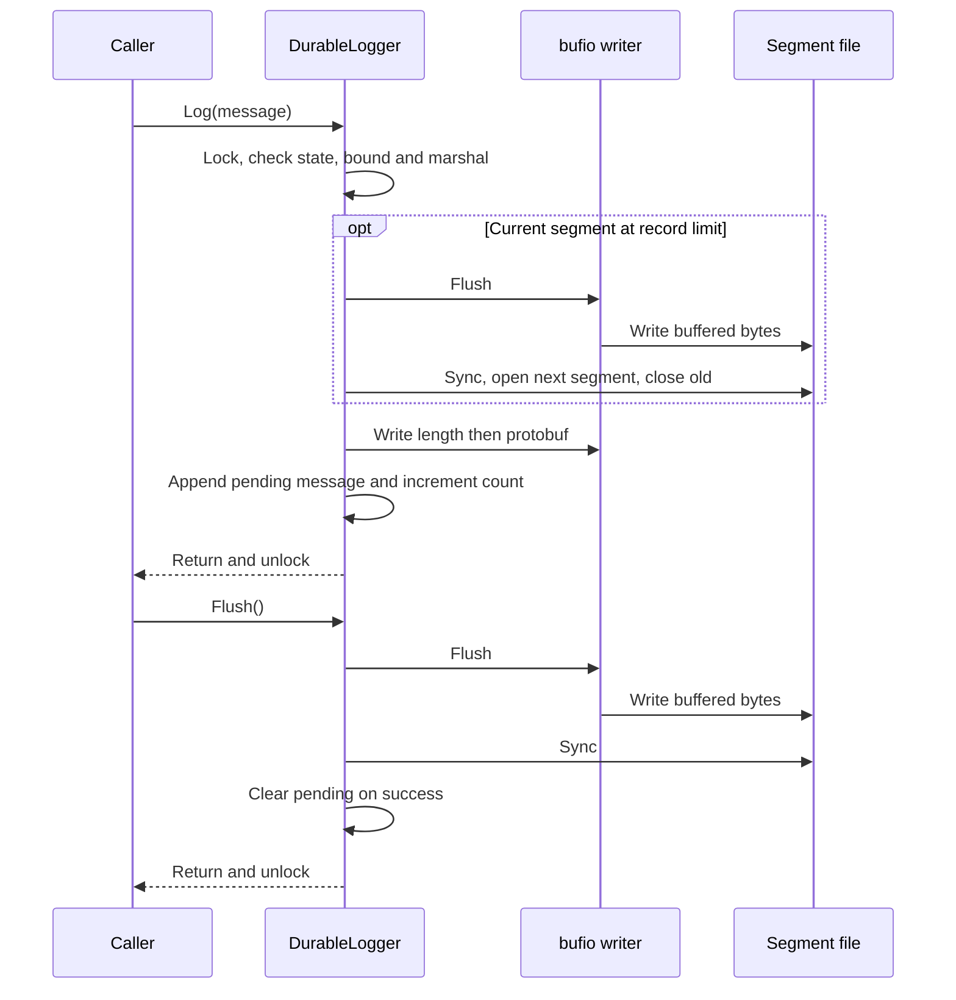
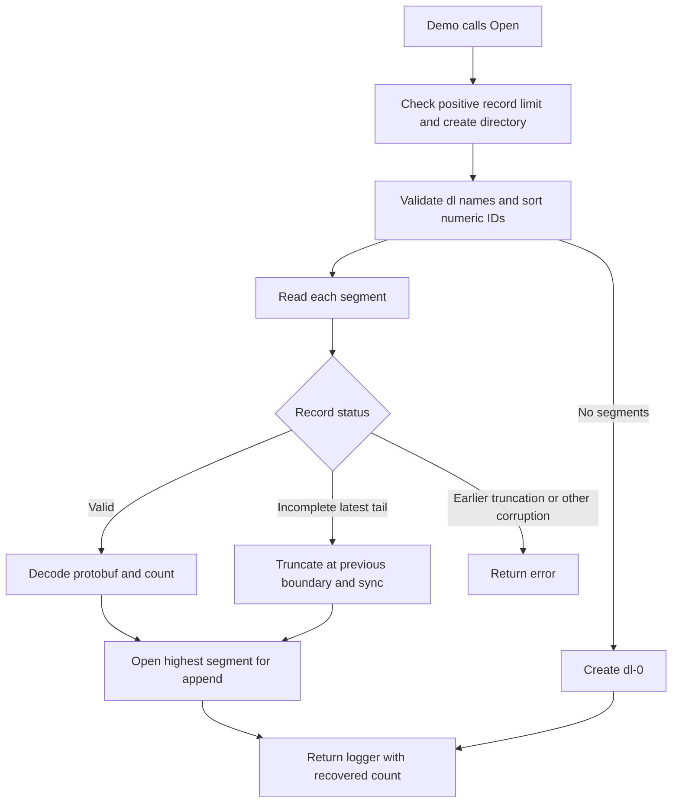

# Flow

## Append and durability

1. `Log` takes the mutex and rejects closed or poisoned state, then rejects messages larger than `64 MiB - 1024` bytes and marshals message plus current UTC timestamp. Marshal/input errors return without poisoning ([core.go:80](../../durablelogs/core.go#L80), [size constant](../../durablelogs/records.go#L17)) · [structure](03-structure.md#durablelogs).
2. If the current count has reached the limit, rotation flushes and syncs the old file, creates the next file exclusively, closes the old file, and replaces the writer. `NewFile` invokes the same path even below the count limit ([core.go:93](../../durablelogs/core.go#L93), [rotate](../../durablelogs/core.go#L128), [NewFile](../../durablelogs/core.go#L147)) · [structure](03-structure.md#durablelogs).
3. The writer emits a four-byte little-endian body length followed by protobuf bytes. Only after both writes succeed does it add the message to `pending` and increment the count; write or rotation failure records poison ([core.go:98](../../durablelogs/core.go#L98)) · [structure](03-structure.md#durablelogs).
4. Explicit `Flush` takes the mutex, checks state, drains bufio, syncs the file, and clears pending messages. Either I/O error poisons the logger. Successful `Log` alone is not a sync acknowledgement ([core.go:110](../../durablelogs/core.go#L110)) · [structure](03-structure.md#durablelogs).

## Startup and recovery

1. The executable calls `Open("./logs", 5)` and terminates on failure. `Open` validates the limit and ensures the directory exists ([main.go:8](../../main.go#L8), [core.go:30](../../durablelogs/core.go#L30)) · [entry structure](03-structure.md#module-root), [library structure](03-structure.md#durablelogs).
2. Discovery ignores names without `dl-`, rejects malformed prefixed names and directories, and sorts IDs numerically. `Open` reads every segment, enabling repair only for the highest ID ([records.go:19](../../durablelogs/records.go#L19), [core.go:42](../../durablelogs/core.go#L42)) · [structure](03-structure.md#durablelogs).
3. The parser reads the header, rejects lengths over 64 MiB, checks the remaining body size, and unmarshals complete records. Only incomplete header/body tails under the repair flag truncate to the last boundary and sync; other read errors, invalid protobuf, and oversized lengths propagate ([records.go:39](../../durablelogs/records.go#L39)) · [structure](03-structure.md#durablelogs).
4. `Open` appends to the latest segment or creates `dl-0`, installing the recovered count in the new logger. A full recovered segment rotates on the next `Log`, not during startup ([core.go:50](../../durablelogs/core.go#L50), [core.go:93](../../durablelogs/core.go#L93)) · [structure](03-structure.md#durablelogs).

## Replay and close

```mermaid
flowchart TD
  A[ReadAll] --> B[Lock and check state]
  B --> C[Flush and sync]
  C --> D[Discover sorted segments]
  D --> E[Decode all without repair]
  E --> F[Return complete record slice and unlock]
  G[Close] --> H[Lock]
  H --> I{Already closed}
  I -->|Yes| J[Return nil and unlock]
  I -->|No| K[Mark closed]
  K --> L[Attempt flush and file close]
  L --> M[Join poison and cleanup errors and unlock]
```

1. `ReadAll` holds the mutex while checking state, flushing, discovering segments, and accumulating decoded records. Any error returns immediately; replay never enables tail repair ([core.go:165](../../durablelogs/core.go#L165)) · [structure](03-structure.md#durablelogs).
2. `Close` takes the mutex, returns nil on repeated calls, otherwise marks closed and joins the saved poison, flush error, and file close error. This attempts cleanup even after poison ([core.go:188](../../durablelogs/core.go#L188)) · [structure](03-structure.md#durablelogs).
3. The demo checks each of ten `Log` calls, attempts close on a logging error, and checks final close after successful writes ([main.go:13](../../main.go#L13)) · [structure](03-structure.md#module-root).

There is no autonomous flush loop: the significant persistence triggers are explicit flush, rotation, replay, and close, as implemented in [core.go](../../durablelogs/core.go#L110).
