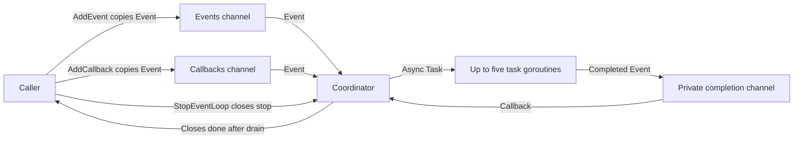

# Architecture

## Overview

One Go process owns an in-memory coordinator and transient task goroutines. The [demo](../../main.go#L136) submits one asynchronous event and waits for draining shutdown. All implementation components live in the [module root](03-structure.md#module-root).

## Components

| Component | Responsibility | Lives in | Talks to |
| --- | --- | --- | --- |
| Submission API | Start once, serialize admission, copy accepted events | [Module root](03-structure.md#module-root), [main.go:97](../../main.go#L97) | Public buffered channels |
| Coordinator | Select work, execute synchronous functions and every callback | [Module root](03-structure.md#module-root), [main.go:60](../../main.go#L60) | Queues and task goroutines |
| Task goroutines | Run asynchronous tasks and report completion | [Module root](03-structure.md#module-root), [main.go:77](../../main.go#L77) | Private completion channel |
| Lifecycle | One-time start and blocking drain | [Module root](03-structure.md#module-root), [main.go:36](../../main.go#L36), [main.go:113](../../main.go#L113) | Coordinator, submitters, stop callers |

## Boundaries and contracts

- [Event](../../main.go#L10) holds `Context`, `TaskContext func(context.Context)`, `Task func()`, `Callback func()`, exported `Async`, and legacy private `isAsync`; either flag selects asynchronous dispatch through `Events`. Nil functions are no-ops ([invoke](../../main.go#L40)). [runTask](../../main.go#L45) skips tasks whose context is already canceled and prefers `TaskContext` over `Task`; a nil context becomes Background. There are no typed results or error returns.
- [AddEvent](../../main.go#L98) and [AddCallback](../../main.go#L123) reject nil pointers and work submitted after stopping. Success means queued, not finished. Both may block while holding the admission mutex; callers must submit from outside tasks and callbacks ([README](../../README.md#L9)).
- Accepted events copy the struct, not the state captured by function closures ([send](../../main.go#L108)). Asynchronous tasks can share memory; synchronization of their captured state belongs to callers.
- The constructor creates public channels with capacity five ([constructor](../../main.go#L31)). Direct writes, replacement, or closure bypass lifecycle invariants and are unsupported ([README](../../README.md#L9)).

## Data model and state

| Entity | Stored in | Key fields | Defined at |
| --- | --- | --- | --- |
| Event | Queues and goroutine locals | Context, TaskContext, Task, Callback, Async, isAsync | [main.go:10](../../main.go#L10) |
| EventLoop | Process memory | Events, Callbacks, once, mu, stopped, stop, done, wg | [main.go:20](../../main.go#L20) |
| Dispatch state | Coordinator locals | completed, active, stopping | [main.go:63](../../main.go#L63) |

No database, filesystem persistence, or replay exists in [the implementation](../../main.go#L3). `active` counts launched tasks whose completion has not yet been consumed, including tasks that have already returned. Channels and captured function state disappear with the process.

## Deployment, failure, and scale

The topology is a standalone local executable with stdout output, not a service ([main](../../main.go#L136)). `go run .` is the documented entry point ([README](../../README.md#L3)); no module deployment or CI configuration is present in the [inventory](03-structure.md).

The fixed limit of five bounds asynchronous dispatch; reaching it disables **all** `Events` consumption, including synchronous work, while completion and explicit callback queues remain selectable ([main.go:71](../../main.go#L71)). A slow synchronous task or callback blocks the coordinator. A nonreturning function can block drain forever; context cancellation requires the running task to cooperate ([runTask](../../main.go#L45)). Panics propagate normally, because [invoke](../../main.go#L40) has no recovery. Queue backpressure is blocking, with no timeout or overload error. See [shutdown flow](02-flow.md#shutdown) and [gotchas](05-decisions.md#gotchas).
