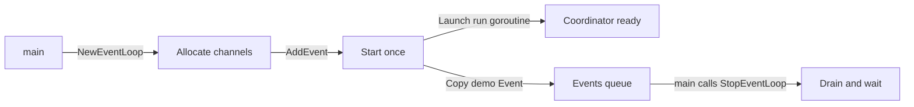
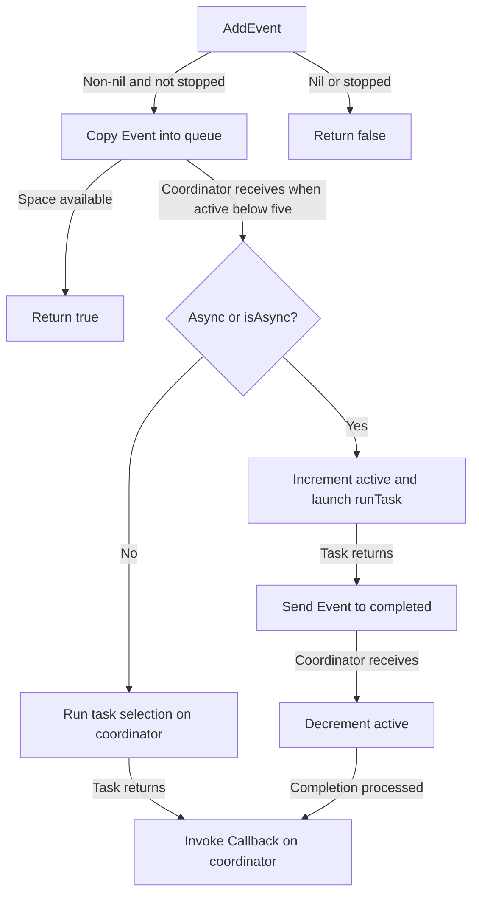
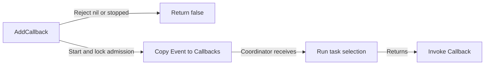
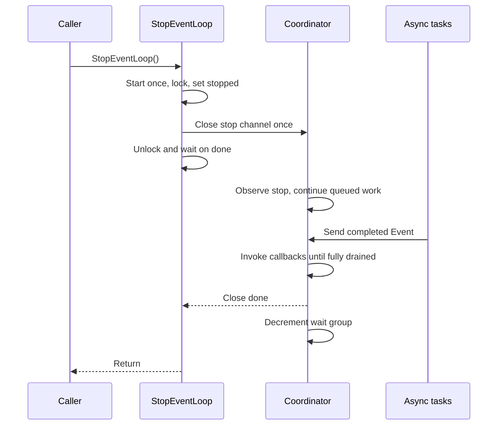
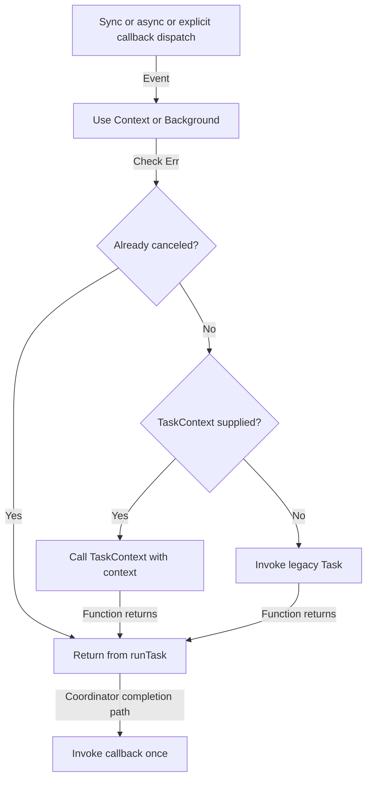

# Flow

## Startup

1. `main` constructs a loop, submits a task printing `task` with a callback printing `done`, then stops it ([main.go:136](../../main.go#L136); [structure](03-structure.md#module-root)).
2. `NewEventLoop` allocates two buffered queues and the stop/done channels; it does not start execution ([main.go:31](../../main.go#L31); [structure](03-structure.md#module-root)).
3. `AddEvent` calls `Start`; `sync.Once` adds one wait-group count and launches `run`, then returns immediately. `AddCallback` and `StopEventLoop` also auto-start ([main.go:36](../../main.go#L36), [main.go:102](../../main.go#L102), [main.go:114](../../main.go#L114), [main.go:127](../../main.go#L127); [structure](03-structure.md#module-root)).

## Task and callback lifecycle

1. Admission rejects nil, starts the loop, locks `mu`, rejects stopped state, then sends a value copy while holding the lock. A full queue blocks the caller ([main.go:98](../../main.go#L98); [structure](03-structure.md#module-root)).
2. `run` allocates a capacity-five completion channel. With five active tasks, it sets its local events channel to nil, disabling that select case until a completion is consumed ([main.go:63](../../main.go#L63); [structure](03-structure.md#module-root)).
3. Synchronous events call `runTask` then invoke the callback directly. Asynchronous events increment `active`, call `runTask` in a goroutine, and send the event to `completed` ([main.go:76](../../main.go#L76); [structure](03-structure.md#module-root)).
4. Completion reception decrements `active` and invokes the callback on the coordinator. No cross-queue or asynchronous completion ordering is promised; nil functions are skipped ([main.go:84](../../main.go#L84), [main.go:40](../../main.go#L40); [structure](03-structure.md#module-root)).

This is one callback invocation per normally completed accepted event, not durable exactly-once processing. A panic or a function that never returns prevents that guarantee ([invoke](../../main.go#L40)).

## Explicit callback submission

1. `AddCallback` shares the admission mutex and shutdown check, but writes to `Callbacks` ([main.go:123](../../main.go#L123); [structure](03-structure.md#module-root)).
2. The coordinator calls `runTask` and then invokes the callback synchronously, ignoring asynchronous flags. This path remains selectable even when five asynchronous tasks are outstanding ([main.go:87](../../main.go#L87); [structure](03-structure.md#module-root)).

## Shutdown

1. `StopEventLoop` starts even an unused loop. Under the admission lock, it marks stopped and closes `stop` once; subsequent submissions return false ([main.go:113](../../main.go#L113); [structure](03-structure.md#module-root)).
2. The coordinator observes stop, sets local `stopping`, and disables that select case. It continues dispatch until `active == 0` and both public queues are empty ([main.go:68](../../main.go#L68), [main.go:90](../../main.go#L90); [structure](03-structure.md#module-root)).
3. Deferred cleanup closes `done` and decrements the wait group. All stop callers wait on the same `done`; repeated stop is safe, but the loop cannot restart ([main.go:61](../../main.go#L61), [main.go:121](../../main.go#L121); [structure](03-structure.md#module-root)).

Stop does not cancel event contexts, interrupt tasks, implement deadlines, or recover panics. Calling it from a task or callback deadlocks completion; an admission blocked on a full queue can also delay stop acquiring the mutex ([README](../../README.md#L9), [admission](../../main.go#L103)).

## Cooperative cancellation

1. Every task path enters `runTask`, selects the event context or Background, and skips the task if `ctx.Err()` is already non-nil ([main.go:45](../../main.go#L45); [structure](03-structure.md#module-root)).
2. Otherwise `TaskContext` takes precedence over `Task`. A running context-aware function must observe cancellation and return; the loop cannot interrupt either function ([main.go:53](../../main.go#L53); [structure](03-structure.md#module-root)).
3. Skipped and normally returned tasks both reach the usual callback path. Cancellation does not undo admission, suppress callbacks, or automatically occur during stop ([main.go:76](../../main.go#L76), [main.go:113](../../main.go#L113); [structure](03-structure.md#module-root)).
4. Regression tests check already canceled sync/async and explicit callback events, and cancellation of a running cooperative task ([main_test.go:63](../../main_test.go#L63), [main_test.go:82](../../main_test.go#L82); [structure](03-structure.md#module-root)).
