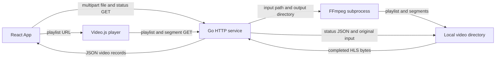
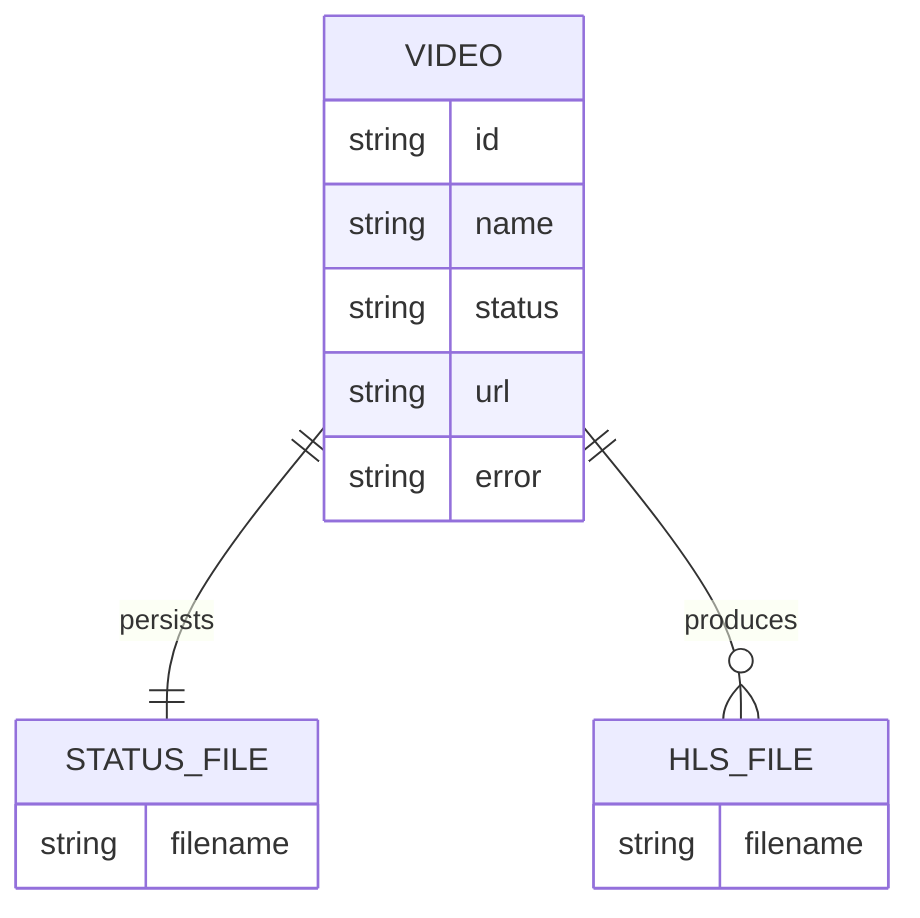
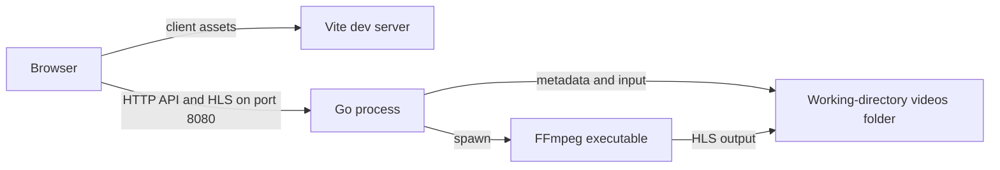

# Architecture

## Overview

The service owns all video state and output, while the browser owns presentation and polls the library. The worker runs in the same Go process as HTTP admission, invoking FFmpeg once per accepted upload; a capacity-one channel admits only one upload/processing lifecycle at a time ([service state](../../server/main.go#L31), [admission](../../server/main.go#L166)).

## Components

| Component | Responsibility | Lives in | Talks to |
| --- | --- | --- | --- |
| Browser bootstrap | Mount React under StrictMode. | [client/src/](../../client/src/) · [map](03-structure.md#client-source) | App |
| Library UI | Select a file, POST it, poll the library, display states and errors. | [client/src/](../../client/src/) · [App](../../client/src/App.tsx#L5) | HTTP API, player |
| Playback adapter | Create and dispose Video.js with an HLS source. | [client/src/](../../client/src/) · [VideoPlayer](../../client/src/VideoPlayer.tsx#L4) | HLS routes |
| HTTP service and worker | Validate uploads, serialize processing, persist status, serve completed media. | [server/](../../server/) · [main.go](../../server/main.go#L95) | FFmpeg, filesystem |
| External transcoder | Produce H.264/AAC VOD HLS with optional audio. | [server/ invocation](../../server/main.go#L258) | Local input/output files |

## Boundaries and contracts

| Boundary | Contract | Evidence |
| --- | --- | --- |
| Upload | `POST /api/videos`, multipart field `file`, 1 byte–100 MiB; total multipart body capped at 101 MiB. Accepted requests return 202 with `id`, `name`, `status: processing`. Busy/shutdown returns 503; malformed/oversized input returns 400; storage failures return 500. | [upload](../../server/main.go#L150) |
| Status | `GET /api/videos` returns an array sorted by random ID; `GET /api/videos/<id>` returns one record or 404. | [routes](../../server/main.go#L106) |
| Media | `GET /hls/<id>/index.m3u8` or a basename ending in `.ts`; valid 16-byte hexadecimal ID and completed status are required. Input and metadata files are not exposed by this route. | [media gate](../../server/main.go#L127) |
| CORS | Every response permits origin `*`; OPTIONS returns 204 and advertises GET/POST/OPTIONS plus Content-Type. No authentication layer is present. | [handler](../../server/main.go#L95) |
| FFmpeg | Direct executable invocation; local file/pipe protocols, selected container formats, first video and optional first audio, two-minute context. The browser file chooser's `video/*` hint is not server-side media validation. | [worker](../../server/main.go#L233), [command](../../server/main.go#L259), [chooser](../../client/src/App.tsx#L20) |

## Data model

This is a file relationship diagram, not database tables. The `video` JSON shape has required `id`, `name`, and `status` plus optional `url`/`error` ([type](../../server/main.go#L24)); the client mirrors it as a TypeScript type ([client type](../../client/src/App.tsx#L3)). States are strings: `processing`, then `completed` or `failed` ([worker](../../server/main.go#L222)). Each generated ID names a directory containing `status.json`, a temporary `input`, and successful `index.m3u8`/`segmentNNN.ts` outputs ([upload](../../server/main.go#L199), [transcode](../../server/main.go#L259)).

## State and persistence

`save` writes `status.tmp`, renames it to `status.json`, then updates a mutex-protected in-memory map; it does not fsync ([save](../../server/main.go#L76)). Startup reads valid ID directories and matching JSON IDs, silently skips unreadable/invalid metadata, and marks previously processing records failed in memory without rewriting them ([loader](../../server/main.go#L44)). The original input is removed after the worker returns, but partial HLS output from failure and interrupted-job inputs have no startup cleanup ([worker](../../server/main.go#L235)).

A failed terminal metadata write leaves an in-memory failed record while disk can retain its previous processing state ([fallback](../../server/main.go#L245)). The slot, worker context, locks, and wait group exist only in memory; there is no persisted queue or retry scheduler ([service](../../server/main.go#L31)).

## Deployment

This is the documented local topology, not a production deployment manifest ([run instructions](../../README.md#L5)). Vite builds the frontend separately; Go does not serve its bundle ([build script](../../client/package.json#L8), [route switch](../../server/main.go#L103)). The literal browser API origin and server working directory matter when moving processes to another host ([configuration](../../client/src/App.tsx#L4), [startup](../../server/main.go#L266)).

## Failure and scale

- An occupied slot rejects immediately with 503, including while the admitted request is still parsing/uploading; there is no waiting queue ([admission](../../server/main.go#L166)).
- FFmpeg errors/cancellation become a generic failed status; detailed output is logged, capped to 2,000 characters in the returned command error ([worker](../../server/main.go#L236), [command error](../../server/main.go#L260)).
- The shutdown path cancels workers and gives HTTP work ten seconds to drain, then closes active connections and waits for service work ([shutdown](../../server/main.go#L274)).
- Scaling is intentionally single-process: independent replicas would have separate maps/slots, and shared files alone would not coordinate them. Library polling returns every record and completed videos each create a player ([list](../../server/main.go#L106), [render](../../client/src/App.tsx#L25)). Storage accumulates without quotas or retention ([documented limits](../../README.md#L22)).
