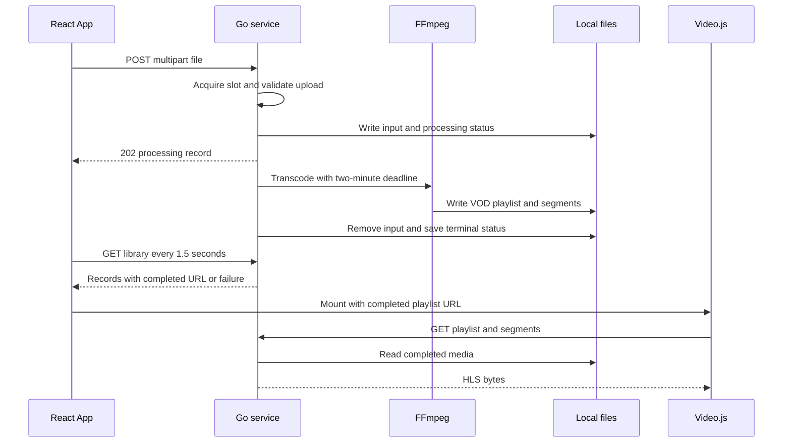
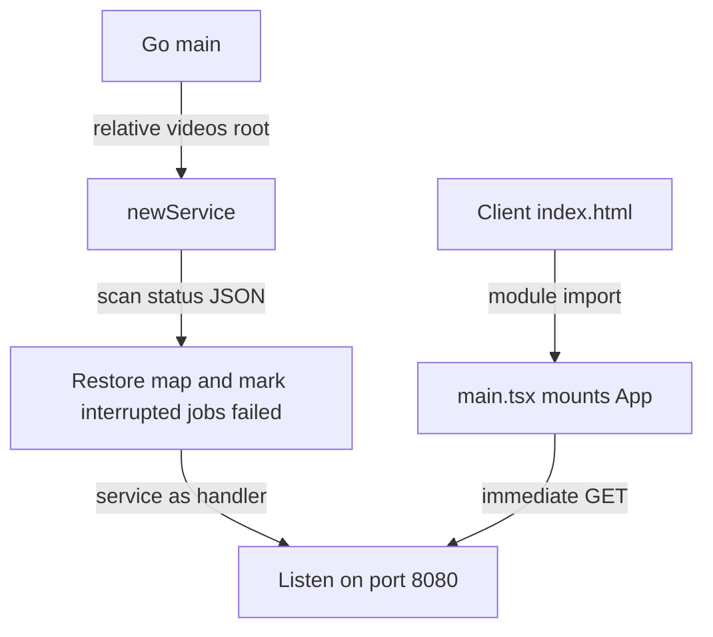
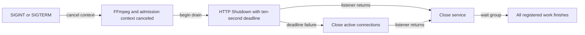
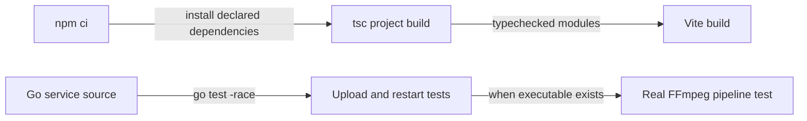

# Flow

## Upload and playback

1. **Select and upload.** The UI appends the selected file to `FormData`, disables the input while the POST is pending, and displays response errors. The returned record is merged into local state; this is an uploading indicator, not byte-progress reporting. [App.tsx:20](../../client/src/App.tsx#L20) · [structure](03-structure.md#client-source).
2. **Admit or reject.** The service registers active work under its lifecycle lock, checks cancellation, and tries its single slot. Closed/canceled or busy service returns 503 before parsing the body. [main.go:150](../../server/main.go#L150) · [structure](03-structure.md#server).
3. **Validate and isolate.** The handler caps the body, parses multipart data with a 1 MiB memory threshold, requires a nonempty `file` no larger than 100 MiB, generates a 16-byte random ID, and writes to `<root>/<id>/input`. The original filename becomes only a display basename. Deferred cleanup removes multipart temporary files and unsuccessful new storage directories. [main.go:178](../../server/main.go#L178) · [structure](03-structure.md#server).
4. **Persist acceptance and detach work.** `save` atomically renames metadata and updates the map. The handler transfers slot ownership to a goroutine, adds worker tracking, and returns a processing record with 202. Processing can finish before that response reaches the browser. [main.go:222](../../server/main.go#L222), [save:76](../../server/main.go#L76) · [structure](03-structure.md#server).
5. **Produce HLS.** A context derived from the service has a two-minute deadline. FFmpeg maps first video/optional audio to H.264/AAC, rounds dimensions down to even numbers, targets two-second HLS segments, and writes a VOD playlist. Segment lengths also depend on keyframes; the command sets no explicit GOP interval. [main.go:233](../../server/main.go#L233), [command:258](../../server/main.go#L258) · [structure](03-structure.md#server).
6. **Publish terminal state.** The worker sets completed plus a relative playlist URL, or failed plus a generic error; it removes the input and saves the record. Save failure updates only memory with a persistence error. Deferred operations release the slot and worker tracking. [main.go:230](../../server/main.go#L230) · [structure](03-structure.md#server).
7. **Refresh the library.** The client fetches immediately and every 1.5 seconds; cleanup aborts fetches and clears the timer. GET returns a copied snapshot sorted by ID. Failed records display their error; completed records with URLs mount players. [App.tsx:9](../../client/src/App.tsx#L9), [main.go:106](../../server/main.go#L106) · [client structure](03-structure.md#client-source) · [server structure](03-structure.md#server).
8. **Play files.** Video.js is created inside an effect and disposed when its source changes or the component unmounts. Its GET requests reach the service's restricted media route, which requires completed status, sets the playlist/transport-stream MIME type, and serves the file. Missing/not-completed media returns 404. [VideoPlayer.tsx:6](../../client/src/VideoPlayer.tsx#L6), [main.go:127](../../server/main.go#L127) · [client structure](03-structure.md#client-source) · [server structure](03-structure.md#server).

The single-record status endpoint is also available, but the current browser uses the collection endpoint ([route](../../server/main.go#L116), [fetch](../../client/src/App.tsx#L12)). No auth or background scheduling flow exists in the current route/worker implementation.

## Startup

1. **Load durable records.** `main` calls `newService("./videos")`; it creates the root with private permissions and restores valid metadata. Root creation/read failures stop startup; individual bad records are skipped. Interrupted work is marked failed only in memory. [main.go:265](../../server/main.go#L265), [loader:44](../../server/main.go#L44) · [structure](03-structure.md#server).
2. **Serve and observe signals.** The server installs header/read/idle timeouts, signal handling, and the service handler, then listens on `:8080`. [main.go:270](../../server/main.go#L270) · [structure](03-structure.md#server).
3. **Mount the browser.** Vite serves an HTML root and module entry; React mounts `App` under StrictMode and the polling effect starts. [index.html:10](../../client/index.html#L10), [main.tsx:5](../../client/src/main.tsx#L5), [App.tsx:9](../../client/src/App.tsx#L9) · [client setup](03-structure.md#client-setup) · [client source](03-structure.md#client-source).

## Shutdown

1. **Cancel and drain.** A signal cancels the service context, so new uploads are rejected and `exec.CommandContext` can terminate FFmpeg. HTTP shutdown gets ten seconds, with a forced close on error. [main.go:274](../../server/main.go#L274), [command:259](../../server/main.go#L259) · [structure](03-structure.md#server).
2. **Join active work.** After the listener and shutdown goroutine finish, `Close` marks the service closed under the same lifecycle lock used by upload admission, cancels again, and waits for registered handlers/workers. Listener errors also trigger the stop path. The service wait itself has no separate timeout. [main.go:284](../../server/main.go#L284), [Close:94](../../server/main.go#L94), [registration:150](../../server/main.go#L150) · [structure](03-structure.md#server).

## Build and verification

1. **Build the client.** `npm run build` runs `tsc -b` before Vite. The root TypeScript project references browser and tool configurations, and Vite enables the React plugin. [package.json:8](../../client/package.json#L8), [tsconfig.json:3](../../client/tsconfig.json#L3), [vite.config.ts:5](../../client/vite.config.ts#L5) · [structure](03-structure.md#client-setup).
2. **Lint the client.** `npm run lint` runs ESLint over TypeScript/TSX with recommended JavaScript, TypeScript, and React Hooks rules plus the React Refresh export rule. [package.json:9](../../client/package.json#L9), [eslint.config.js:7](../../client/eslint.config.js#L7) · [structure](03-structure.md#client-setup).
3. **Test backend behavior.** The first test replaces `transcode` with a fake playlist writer, uploads multipart data, waits for work, fetches media, and reconstructs the service to verify completed status survives. Another test rejects an empty malformed body. [main_test.go:16](../../server/main_test.go#L16), [invalid request:78](../../server/main_test.go#L78) · [structure](03-structure.md#server).
4. **Exercise the real encoder when available.** The FFmpeg test generates a tiny source video, calls the actual transcoder, checks `EXT-X-ENDLIST`, and requires at least one `.ts` segment. It skips if FFmpeg is absent and does not exercise browser playback. [main_test.go:54](../../server/main_test.go#L54) · [structure](03-structure.md#server).
