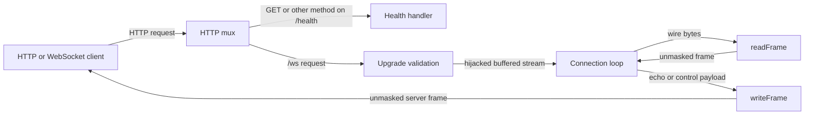

# Architecture

## Overview

All runtime components live in one [module root](../../): an HTTP mux selects a health handler or WebSocket handler, and the latter owns the hijacked connection until it returns. Framing and message assembly are separate functions and local state within [main.go](../../main.go#L34), without a service layer or shared connection registry.

## Components

| Component | Responsibility | Lives in | Talks to |
| --- | --- | --- | --- |
| HTTP entry | Port 8080, routing, five-second header timeout, simple health response. | [Module root](../../), [main.go:215](../../main.go#L215) | HTTP clients and upgrade handler |
| Upgrade gate | Validates request and optional origin, writes 101 response, preserves buffered bytes. | [Module root](../../), [main.go:34](../../main.go#L34) | HTTP server and hijacked stream |
| Connection loop | Reassembles text/binary messages, handles ping/pong/close, applies deadlines. | [Module root](../../), [main.go:66](../../main.go#L66) | Frame codec |
| Frame codec | Reads masked client frames, writes final unmasked server frames, validates close payloads. | [Module root](../../), [main.go:127](../../main.go#L127) | Buffered connection reader/writer |

## Boundaries and contracts

- **HTTP to WebSocket:** GET, matching upgrade tokens, a Base64 key decoding to 16 bytes, and version 13 are required. A supplied origin must use HTTP(S) and have the same host, including port, as the request; origin absence is accepted. Failures return 400, 426, 403 or 500 before hijack ([validation](../../main.go#L35)).
- **Wire to frame:** The parser requires masking, zero reserved bits, canonical lengths and supported opcodes. Data frames are at most 1 MiB; control frames must be final and at most 125 bytes ([parser](../../main.go#L133)).
- **Frame to message:** One text or binary message may be assembling per connection. Continuations require an active message, new data opcodes require no active message, and completed text must be UTF-8. Echo preserves the original opcode but combines fragments into one final frame ([loop](../../main.go#L93)).

## Data model

| Entity | Stored in | Fields | Defined at |
| --- | --- | --- | --- |
| Frame | Per-read memory | `fin`, `op`, unmasked `data` | [main.go:127](../../main.go#L127) |
| In-progress message | Handler-local memory | `message` byte slice and `messageOp`, zero when idle | [main.go:66](../../main.go#L66) |

There are no persistent entities or relationships requiring an ER diagram. Each handler owns its bytes, resets the assembled message after echo, and closes its socket on return ([main.go:61](../../main.go#L61), [main.go:121](../../main.go#L121)).

## Deployment

The implemented topology is a plain HTTP listener; there is no TLS, authentication, broker or deployment configuration in the module. The [README](../../README.md#L9) suggests an appropriate front endpoint when needed, but does not supply one. The [entry point](../../main.go#L216) has no signal handling or graceful drain for hijacked connections.

## Failure and scale

- Each frame read gets a fresh 60-second deadline and writes get 10 seconds; non-EOF read errors, including timeouts and oversized frames, trigger an attempted close 1002. Write failure ends the handler ([main.go:69](../../main.go#L69)).
- Assembled overflow uses 1009; invalid completed text uses 1007; invalid close payloads use 1002 ([main.go:79](../../main.go#L79), [main.go:108](../../main.go#L108)). Close writes are best effort and the TCP connection closes immediately afterward.
- Memory limits are per frame/message, not a global connection budget. A frame allocation can coexist with the assembly buffer ([main.go:175](../../main.go#L175), [main.go:112](../../main.go#L112)). The standard HTTP server serves concurrent connections, but the application adds no admission control or total session duration limit.
- Independent instances could serve independent echoes because state is connection-local (inference from [handler locals](../../main.go#L66)); existing sockets cannot migrate between processes.
