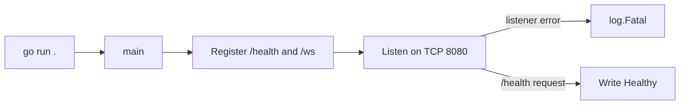
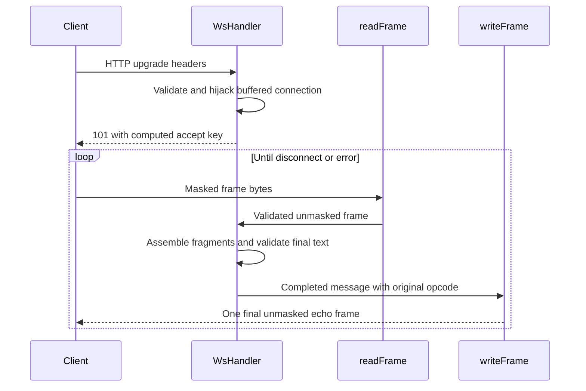
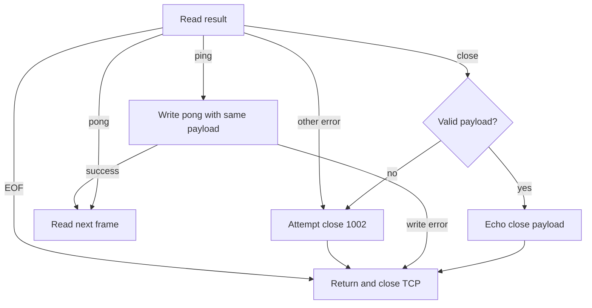
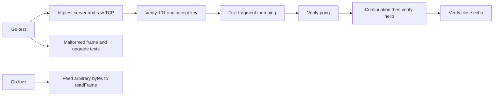

# Flow

## Startup

1. **Compile and start** — the `websockets` module selects Go 1.23.2. [go.mod:1](../../go.mod#L1) · [structure](03-structure.md#module-root).
2. **Register routes and listen** — `main` creates a mux, adds both handlers and starts a server with a five-second read-header timeout. Listener errors reach `log.Fatal`. [main.go:216](../../main.go#L216) · [structure](03-structure.md#module-root).
3. **Health request** — `/health` writes `Healthy`; it performs no dependency or connection checks and does not restrict methods. [main.go:215](../../main.go#L215) · [structure](03-structure.md#module-root).

## Upgrade and echo

1. **Validate upgrade** — decode the key, verify GET and tokenized headers, require version 13, then check a supplied origin. Invalid requests stop with an HTTP error. [main.go:35](../../main.go#L35) · [structure](03-structure.md#module-root).
2. **Switch protocols** — require `http.Hijacker`, retain its buffered reader/writer, compute Base64(SHA-1(key + GUID)), write and flush 101, and defer socket close. [main.go:30](../../main.go#L30), [main.go:52](../../main.go#L52) · [structure](03-structure.md#module-root).
3. **Read a bounded frame** — set the read deadline, read the two-byte header and optional extended length, reject invalid bits/opcodes/lengths, read mask and payload with `io.ReadFull`, then XOR unmask. [main.go:69](../../main.go#L69), [main.go:133](../../main.go#L133) · [structure](03-structure.md#module-root).
4. **Track message state** — text/binary starts a message, continuation requires one, and an interleaved new data message causes close 1002. Enforce the aggregate 1 MiB bound before appending. [main.go:93](../../main.go#L93) · [structure](03-structure.md#module-root).
5. **Echo on FIN** — validate completed text as UTF-8, write the assembled message using its initial opcode, then clear state. The writer chooses a short, 16-bit or 64-bit length header, sets FIN, omits masking and flushes. [main.go:113](../../main.go#L113), [main.go:184](../../main.go#L184) · [structure](03-structure.md#module-root).

## Control frames and termination

1. **Handle parser failure** — set the write deadline after reading. EOF returns silently; other read errors attempt close 1002 before return. [main.go:70](../../main.go#L70) · [structure](03-structure.md#module-root).
2. **Handle ping/pong without disturbing fragments** — ping writes pong with identical bytes; pong is ignored. Both continue the loop before message assembly. [main.go:86](../../main.go#L86) · [structure](03-structure.md#module-root).
3. **Handle close** — accept an empty close or a permitted two-byte code plus valid UTF-8 reason. Echo valid payloads; otherwise send 1002. Return immediately rather than waiting for further frames. [main.go:79](../../main.go#L79), [main.go:205](../../main.go#L205) · [structure](03-structure.md#module-root).
4. **Handle data errors** — oversized assembled messages send 1009 and invalid text sends 1007; write failures end the connection. Close writes ignore errors because teardown follows. [main.go:108](../../main.go#L108), [main.go:202](../../main.go#L202) · [structure](03-structure.md#module-root).

## Verification flow

1. **Exercise wire behavior** — a raw TCP client upgrades against `httptest`, sends fragmented text with an intervening ping, then checks echo and close. Its helpers use short payload lengths, so this test does not validate extended frame lengths. [main_test.go:17](../../main_test.go#L17), [main_test.go:28](../../main_test.go#L28) · [structure](03-structure.md#module-root).
2. **Reject selected bad inputs** — tests cover unmasked frames, reserved bits/opcode, fragmented control, noncanonical length, invalid close codes and missing upgrade headers. [main_test.go:64](../../main_test.go#L64) · [structure](03-structure.md#module-root).
3. **Fuzz the parser** — a short masked text seed initializes byte-input fuzzing; inputs above `maxMessage+14` are skipped. The target exercises parser robustness without asserting full protocol conformance. [main_test.go:86](../../main_test.go#L86) · [structure](03-structure.md#module-root).
